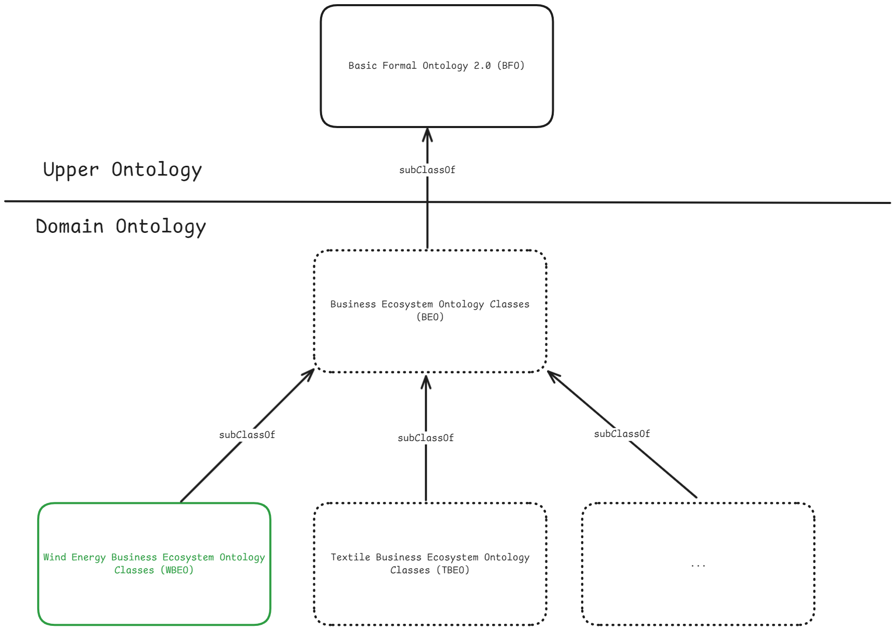

# Wind Business Ecosystem Ontology (WBEO)

The Wind Business Ecosystem Ontology (WBEO) is a semantic model that captures the stakeholders, relationships, and organizational structures within the wind energy sector. This ontology provides a structured vocabulary and framework for representing the complex business ecosystem of the wind energy industry. Future work will focus on extending the ontology to include additional stakeholders, relationships, and organizational structures, as well as intensional work e.g., description for the
concepts and relations. 

# Repository Overview 📂

This repository contains the ontology files and plans for future work. 

- **📊 Figures**: Diagrams and illustrations related to WBEO
  - `Plan.png`: Visual representation of the framework's planned architecture and components, including the Wind Business Ecosystem Ontology (WBEO) and its relationship to the Business Ecosystem Ontology (BEO) and Basic Formal Ontology (BFO).

- **🧩 ontology**: Wind Energy Business Ecosystem Ontology
  - `WBEO.rdf`: Wind Energy Business Ecosystem Ontology in RDF format

<figure>
  
<figcaption><strong>Figure 1:</strong> Planned Ontology Architecture showing the hierarchical integration of WBEO (Wind Business Ecosystem Ontology). The WBEO is positioned as a domain-specific ontology that inherits from the more general Business Ecosystem Ontology (BEO), which in turn extends from the Basic Formal Ontology (BFO) 2.0 at the upper ontology level. This architecture allows for parallel domain ontologies (like Textile BEO) to be developed using the same foundational structure, enabling interoperability and extensibility across business domains while maintaining domain-specific knowledge representation for the wind energy sector.</figcaption>
</figure>

